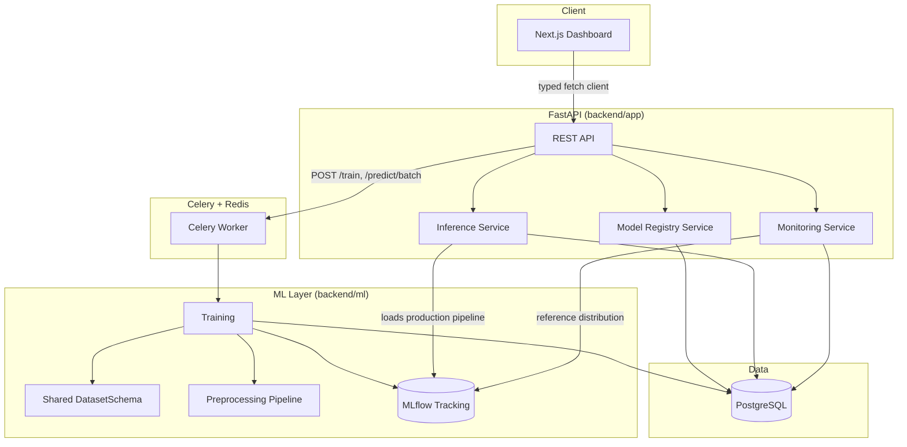
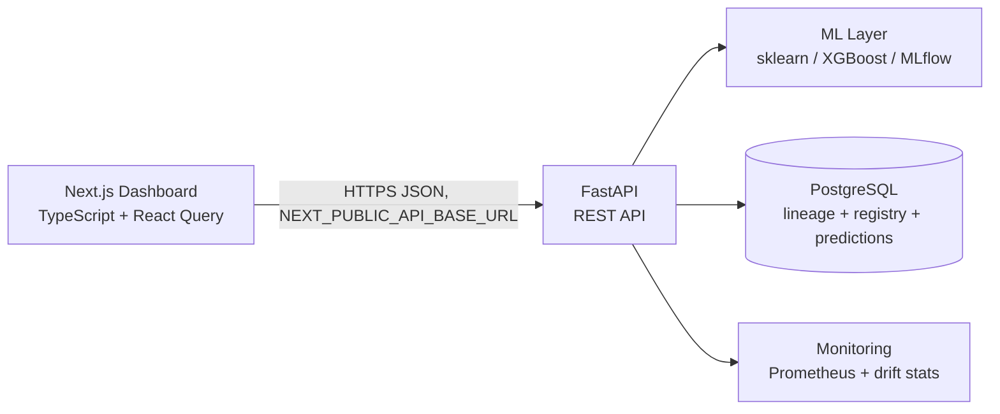
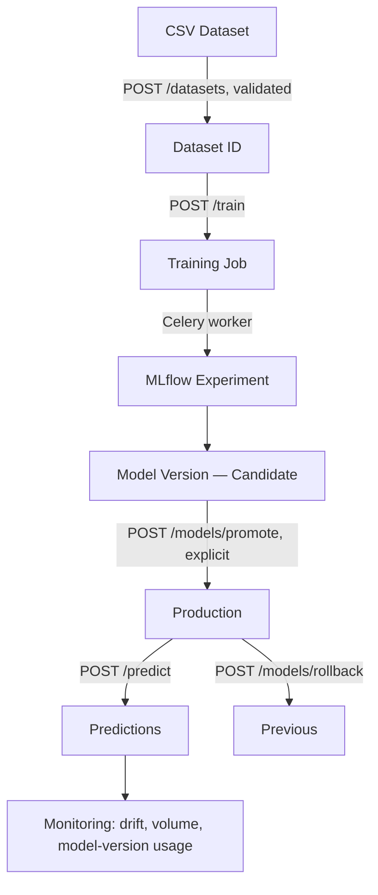

# PredictIQ — End-to-End ML Prediction & Monitoring Platform

A production-style ML platform demonstrating the full lifecycle of a tabular
classification model — dataset ingestion, reproducible training, experiment
tracking, a real model registry with an explicit promotion workflow,
production inference, prediction logging, and real statistical drift
detection — built around a public dataset (IBM's Telco Customer Churn) with
a FastAPI backend and a Next.js operations dashboard.

This is a personal portfolio project. No proprietary or confidential data is
used anywhere in it.

> **Screenshot note**: this README describes every dashboard page using the
> platform's actual, real data (the same JSON/text captured while manually
> verifying each page against the live backend) rather than embedded image
> files — the tooling used to build this project couldn't mechanically save
> browser screenshots as committed PNGs. Run the app locally (see
> [Local setup](#local-setup)) to see it live.

---

## Table of contents

1. [Project overview](#project-overview)
2. [Problem statement](#problem-statement)
3. [Architecture](#architecture)
4. [Tech stack](#tech-stack)
5. [ML workflow](#ml-workflow)
6. [API reference](#api-reference)
7. [Database design](#database-design)
8. [MLOps workflow: the model registry](#mlops-workflow-the-model-registry)
9. [Monitoring](#monitoring)
10. [Dashboard](#dashboard)
11. [Local setup](#local-setup)
12. [Testing](#testing)
13. [Deployment status](#deployment-status)
14. [Limitations](#limitations)
15. [Future improvements](#future-improvements)
16. [Interview talking points](#interview-talking-points)

---

## Project overview

PredictIQ predicts customer churn for a telecom operator and exposes the
*entire* engineering system around that prediction — not just a model
behind an endpoint. The explicit goal was to build something that reads as
an ML **platform**, where:

- a dataset can be uploaded and is validated before anything touches it,
- training runs asynchronously and logs everything needed to reproduce a
  model later (exact data, exact code version, exact config),
- a model never reaches production by accident — promotion is a deliberate,
  auditable, transactional action,
- every prediction is traceable to the exact model version that produced it,
  even after that version is retired,
- monitoring reports real drift statistics computed from real logged
  predictions, and honestly says "not enough data yet" rather than
  fabricating a number when it doesn't have enough,
- a dashboard makes all of the above legible in under a minute.

## Problem statement

Churn prediction is a standard, well-understood tabular ML problem — which
is deliberate. The interesting engineering here isn't the model; it's
everything *around* the model that a real ML team actually has to build:
lineage, reproducibility, a registry with a real state machine, safe
promotion/rollback, async training that doesn't block an API request, and
monitoring grounded in the platform's own real data.

## Architecture



**Next.js → FastAPI → ML/Database/Monitoring**, concretely:



The frontend never talks to Postgres, MLflow, or Redis directly — it only
knows the FastAPI base URL (`NEXT_PUBLIC_API_BASE_URL`, a public,
non-secret config value). All real credentials (`DATABASE_URL`,
`MLFLOW_TRACKING_URI`, `REDIS_URL`, etc.) live only in the backend's `.env`,
never in frontend code or environment variables.

### The full lifecycle the dashboard is built to explain



## Tech stack

**Backend**: Python 3.12, FastAPI, Pydantic v2, SQLAlchemy 2.0, Alembic,
PostgreSQL, Celery, Redis, MLflow, scikit-learn, XGBoost, pandas,
prometheus-client.

**Frontend**: Next.js 16 (App Router), TypeScript, Tailwind CSS 4,
TanStack Query (client-side data fetching/polling), Recharts, Vitest +
React Testing Library.

## ML workflow

```
CSV upload → schema/quality validation → preprocessing (shared, fit-once
Pipeline) → feature engineering → train/val/test split (stratified, no
leakage) → train Logistic Regression / Random Forest / XGBoost → evaluate
(precision, recall, F1, ROC-AUC, confusion matrix — never accuracy alone)
→ log to MLflow (params, metrics, artifact, dataset lineage, git commit)
→ register as a candidate in Postgres
```

The exact same fitted `sklearn.Pipeline` object (feature engineering +
`ColumnTransformer` + classifier) that gets logged during training is what
inference loads and calls `.predict_proba()` on directly — there is no
second, hand-maintained preprocessing implementation at serving time to
drift out of sync with training.

Class imbalance (~26.5% churn in the Telco dataset) is handled via
`class_weight="balanced"` (Logistic Regression, Random Forest) and
`scale_pos_weight` (XGBoost) — not resampling, which would need to be
carefully scoped to the training fold only to avoid leakage.

## API reference

All endpoints are implemented in `backend/app/routers/`. Full interactive
docs are available at `/docs` (FastAPI's generated Swagger UI) whenever the
backend is running.

| Area | Endpoints |
|---|---|
| Datasets | `POST /datasets`, `GET /datasets`, `GET /datasets/{id}` |
| Training | `POST /train`, `GET /jobs`, `GET /jobs/{id}` |
| Model registry | `GET /models`, `GET /models/{id}`, `GET /models/{id}/metrics`, `GET /models/production`, `POST /models/promote`, `POST /models/rollback` |
| Inference | `POST /predict`, `POST /predict/batch`, `GET /predictions`, `GET /predictions/{id}` |
| Monitoring | `GET /monitoring/summary`, `GET /monitoring/drift`, `GET /monitoring/model-usage`, `GET /monitoring/jobs`, `GET /metrics` (Prometheus format) |
| Health | `GET /health` |

## Database design

Postgres is the single source of truth for lineage and lifecycle state
(no separate monitoring database — Phase 6 deliberately reused the
existing tables rather than adding one). Core tables:

- **`datasets`** — uploaded CSVs, their validation report, row/column
  counts, and a SHA-256 content hash.
- **`jobs`** — async training and batch-prediction jobs; `queued` →
  `running` → `completed`/`failed`, with `dataset_id`, timestamps, and a
  safe (non-traceback) error message.
- **`model_versions`** — the registry. Each row references its
  `dataset_id`, nullable `training_job_id`, MLflow run ID, git commit,
  snapshotted test metrics/params, and lifecycle `stage`.
- **`model_lifecycle_events`** — an audit trail of every promotion,
  demotion, archive, and rollback.
- **`predictions`** — every real inference result, with the exact
  `model_version_id` that produced it (never just "production").

Two Postgres **partial unique indexes** enforce "at most one production
model" and "at most one previous model" at the database level — not just
in application code — so a race between two concurrent promotions is
caught by the database itself.

## MLOps workflow: the model registry

MLflow remains the source of truth for experiment tracking (params,
metrics, the model artifact). `model_versions` in Postgres is the
*application-level* lifecycle on top of it — `candidate` → `production` →
`previous` → `archived` — driven only by explicit API calls, never
automatically:

- Training always produces **candidates**. A candidate never becomes
  production on its own.
- `POST /models/promote` is gated by a configurable policy: the candidate
  must have a valid linked dataset, all required metrics present, and
  (optionally) a live-verified MLflow artifact.
- Promoting demotes the current production model to `previous` and
  archives whatever was previously `previous` — all in one transaction,
  with the database's partial unique indexes as the real backstop against
  a race producing two production models.
- `POST /models/rollback` swaps production and previous back.

## Monitoring

See [`docs/monitoring.md`](docs/monitoring.md) for the full methodology
write-up (why KS for numeric features, why PSI for categorical, threshold
definitions, minimum-sample-size reasoning, and the reference-distribution
lineage). In short:

- **Reference distribution**: computed on demand from the exact training
  dataset of the model version being checked (`model_versions.dataset_id`
  → the real CSV on disk), never a generic/unrelated dataset.
- **Numeric drift**: two-sample Kolmogorov–Smirnov test.
- **Categorical drift**: Population Stability Index over category
  proportions, with epsilon smoothing for categories unseen in one side.
- **Minimum sample size**: configurable (`DRIFT_MIN_SAMPLES`, default 100)
  — below it, the API returns `"status": "insufficient_data"` with the
  actual count, never a fabricated score.
- **Model-version isolation**: drift for one model version never mixes in
  predictions from a different (e.g. superseded) version.

## Dashboard

Seven pages, all built against the real backend — nothing here is
hardcoded demo data:

- **`/dashboard`** — production model, system health, prediction volume,
  drift status, active/failed training jobs, all from
  `GET /monitoring/summary` + `GET /health`. Explicitly labels
  process-scoped Prometheus counters as such (e.g.
  `total_predictions_this_process`) rather than presenting them as a
  global total — the real backend value from `GET /monitoring/summary`
  distinguishes real database-backed prediction counts from in-process
  Prometheus counters, and the UI preserves that distinction.
- **`/models`** — every model version with real metrics (ROC-AUC,
  precision, recall, F1), lifecycle stage badges, dataset, and training
  job, filterable by stage.
- **`/models/[id]`** — full metadata (MLflow run, git commit, dataset
  content hash, training config), a five-step lineage diagram (Dataset →
  Training Job → MLflow Run → Model Version → Predictions), the confusion
  matrix, and explicit Promote/Rollback actions — each behind a
  confirmation dialog that shows exactly what will change before
  anything happens.
- **`/jobs`** — every training/batch-prediction job, polling active ones
  every 4s, with real durations and the model versions each job produced.
- **`/predictions`** — real inference history, paginated, filterable by
  model version and date. Raw `input_features` are shown only in the
  per-prediction detail drawer (opened by clicking a row), never in the
  list table.
- **`/monitoring`** — prediction volume and model-version distribution,
  plus the full drift breakdown (feature, test, score, threshold, status)
  with a chart and an explicit note that drift measures input
  distribution change, not model accuracy.
- **`/train`** — submit a real async training job (dataset, algorithms,
  hyperparameters) and watch it progress queued → running →
  completed/failed in place, no page reload.

Every page has real loading, error, and empty states (a `role="status"`
spinner, a `role="alert"` error with retry, and a labeled empty state) —
never a blank screen.

## Local setup

### Prerequisites

- Python 3.11+ (developed against 3.12)
- Node.js 20+
- PostgreSQL and Redis running locally (this project was developed and
  tested against Homebrew-installed `postgresql@16` and `redis` on macOS,
  **not** Docker — see [Deployment status](#deployment-status))
- macOS only: `brew install libomp` (XGBoost needs it; without it, `import
  xgboost` segfaults on load)

### Backend

```bash
cd backend
python3.12 -m venv .venv && source .venv/bin/activate
pip install -r requirements.txt
cp .env.example .env   # edit DATABASE_URL/REDIS_URL/MLFLOW_TRACKING_URI as needed
alembic upgrade head
uvicorn app.main:app --reload --port 8123
```

A real MLflow tracking server (not the client's local file-store default)
and a Celery worker are both required for full functionality:

```bash
# in a second terminal, from backend/
mlflow server --backend-store-uri sqlite:///mlruns_server/mlflow.db \
  --default-artifact-root ./mlruns_server/artifacts --host 127.0.0.1 --port 5001

# in a third terminal, from backend/ (--pool=solo is a macOS-only
# workaround — Celery's default prefork pool can segfault on macOS when
# forking a process that already loaded XGBoost/numpy/libomp)
celery -A workers.celery_app worker --loglevel=info --pool=solo
```

### Frontend

```bash
cd frontend
npm install
cp .env.local.example .env.local   # NEXT_PUBLIC_API_BASE_URL, defaults to http://localhost:8123
npm run dev
```

Visit `http://localhost:3000` (redirects to `/dashboard`).

## Testing

**Backend**: 173 tests (`cd backend && pytest`), run against a real local
PostgreSQL test database and, where the test specifically exercises it, a
real Redis connection — not mocked DB/queue behavior for anything
verifying constraints or transactions.

**Frontend**: 23 tests across 7 files (`cd frontend && npm test`) covering
model list rendering, model detail + lineage, training job submission,
the prediction table (including that raw features never leak into the
list view), monitoring's insufficient-data/ok/no-production-model states,
and API-client error handling (HTTP errors, malformed JSON, network
failure, timeout).

Both suites are lint-clean (`ruff check .` / `npm run lint`) and the
frontend has a clean `npm run build`.

## Deployment status

Docker/Docker Compose packaging (mentioned in the original project
brief) was **not built** as part of any of the implemented phases — every
phase focused on a specific backend or frontend concern, and
containerization was never assigned. Documenting Docker instructions here
without the actual `Dockerfile`/`docker-compose.yml` existing would be
exactly the kind of "fake functionality presented as complete" this
project's own guidelines rule out. The `infra/` directory is reserved for
this and is currently empty — see
[Future improvements](#future-improvements).

Everything described in this README **is** real and has been run
end-to-end locally: real Postgres, real Redis, a real MLflow tracking
server, a real Celery worker, and the real Next.js dashboard against the
real FastAPI backend.

## Limitations

- **No containerization yet** (see above).
- **No authentication/authorization** — every endpoint is open. Adding
  auth was out of scope for every phase and wasn't bolted on
  speculatively.
- **Prometheus counters are per-process** — a separate Celery worker
  process's prediction counts don't appear in the API process's
  `/metrics`. The dashboard labels this explicitly rather than hiding it;
  real cross-process aggregation would need `prometheus_client`'s
  multiprocess mode or a Pushgateway.
- **Multi-worker model-cache staleness** — with more than one API worker
  process, a promotion is only guaranteed visible to every worker after
  each has served one more request (no cross-process push invalidation).
- **macOS + Celery prefork**: Celery's default worker pool can segfault
  on macOS when forking a process that already loaded XGBoost/numpy/
  libomp; local dev uses `--pool=solo`. This is a macOS-specific
  development quirk, not a deployment concern for Linux containers.
- **Drift reference recomputed per request** — the reference distribution
  is read from the training CSV on each `GET /monitoring/drift` call
  rather than cached; fine at this project's scale, would need caching
  under real load.

## Future improvements

- Docker Compose packaging (backend, worker, frontend, Postgres, Redis,
  MLflow, as originally scoped).
- Real authentication (even a simple API-key gate) before this leaves a
  local/demo context.
- Cross-process Prometheus aggregation (multiprocess mode or a
  Pushgateway) so worker-side prediction counts are visible from `/metrics`.
- Cache the drift reference distribution per model version instead of
  recomputing it from the CSV on every request.
- CI (GitHub Actions) running both test suites and lint on every push —
  scoped but not implemented in these phases.

## Interview talking points

- **Why a shared `DatasetSchema` module** instead of separate column
  lists in ingestion, training, and inference: one source of truth that
  can't silently drift between the three stages (backend/ml/schema.py).
- **Why the exact same fitted Pipeline object serves both training and
  inference**: no second hand-maintained preprocessing implementation at
  serving time.
- **Why partial unique indexes, not just application checks**, enforce
  "one production model": a race between two concurrent promotion
  requests is caught by Postgres itself, and this was validated with a
  concurrency test using a `threading.Barrier` to force a genuine race
  (a naive two-thread test turned out to run sequentially by accident on
  fast local Postgres).
- **Why KS for numeric and PSI for categorical drift**, not one test for
  everything — see `docs/monitoring.md`.
- **Two real "process-global config" bugs found and fixed during manual
  verification**, not caught by unit tests alone: MLflow's tracking URI
  defaulting to a local file store in both the API process and the Celery
  worker (fixed by centralizing configuration in
  `app/core/mlflow_config.py`, with a regression test), and Celery's
  `worker_hijack_root_logger` silently discarding structured JSON logs
  inside the worker.
- **A real frontend bug found via manual browser verification, not code
  review**: pages checked `useQuery`'s `isLoading` (only true while
  actively fetching) instead of `isPending` (true for the whole pending
  status, including a retry's backoff pause) before deciding whether to
  show a loading state — a transient in-between-retries render could fall
  through to an error branch with `error` still `null`, showing a
  hardcoded fallback message instead of the real backend error. Fixed
  across all seven pages, with a regression test.
