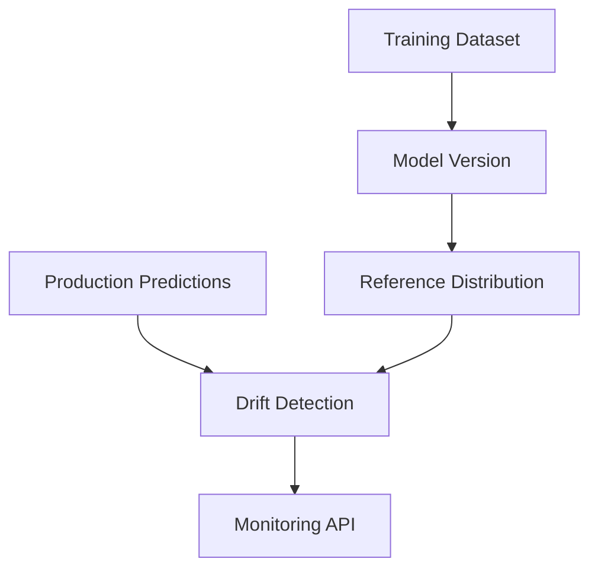

# Monitoring & Drift Detection

## What "drift" means here

Data drift is a change in the statistical distribution of the features a
model receives at inference time, relative to the distribution it was
*trained* on. A model's learned decision boundary reflects the training
distribution; when production inputs shift away from it, the model's
accuracy on new data can degrade even though nothing about the model
itself has changed. Drift detection doesn't measure accuracy directly
(that would need ground-truth labels, which don't exist at inference
time for churn prediction) — it's an early-warning proxy: "the world
feeding this model looks different than the world it learned from."

## Reference dataset selection — the model-version problem

A production model can be replaced (Phase 3's promotion workflow), and
different model versions can be trained on different datasets. Comparing
today's traffic against one fixed "the" historical dataset would be
wrong in both directions: it could show drift that's really just "this
newer model was trained on different, non-drifted data," or hide real
drift by comparing against training data that doesn't correspond to
what's actually deployed.

PredictIQ avoids this by keeping the reference distribution *scoped to
the exact model version being checked*, resolved through the lineage
Phase 5 already established:



Concretely: `model_version.dataset_id` points at the exact `Dataset` row
used to train it, whose `storage_path` is the exact CSV file and whose
`content_hash` is that file's SHA-256 — the same content hash logged as
an MLflow tag on the training run (`model_version.mlflow_run_id`) and
carried through `model_version.training_job_id` back to the `Job` that
requested the training. `GET /monitoring/drift` reports
`reference_dataset_id`, `reference_dataset_content_hash`, and
`reference_training_job_id` in every response specifically so this
chain is auditable per-request, not just assumed correct.

The reference distribution itself is *not* precomputed or cached in a
new table — it's built by re-reading that dataset's CSV file on demand
(`monitoring/drift.py::build_reference_distribution`). This avoids
adding a monitoring-specific database or a stale-cache problem; a drift
check on a 7,000-row CSV takes well under a second.

## Methodology

### Numeric features → two-sample Kolmogorov-Smirnov test

`scipy.stats.ks_2samp(reference_values, production_values)` compares the
two samples' empirical CDFs directly and returns the maximum vertical
distance between them (the KS statistic, 0–1) plus a p-value. KS needs
no binning choice — an arbitrary bin width would otherwise change PSI's
answer for a continuous variable like `tenure` or `MonthlyCharges`. This
is why KS is used for numeric features and PSI (below) is used for
categorical ones, not interchangeably.

`drift_detected = statistic >= DRIFT_KS_THRESHOLD` (default `0.10`).

### Categorical features → Population Stability Index (PSI)

KS assumes an ordered, continuous variable — there is no "CDF" of
`PaymentMethod` values, so applying KS to a category would not be
meaningful (this is the "do not blindly apply KS to categorical
variables" requirement). PSI instead compares the *proportion* of each
category directly:

```
PSI = Σ_category (production% - reference%) × ln(production% / reference%)
```

This is the standard choice for categorical/discrete drift in the
ML-ops and credit-risk-modeling literature, and it naturally handles
"bins" that are just the categories themselves — no binning ambiguity.

**Unseen categories**: a category present on only one side (a new
`PaymentMethod` never seen in training, or a training category that
happens not to appear in a given production window) would make the log
term undefined (division by zero / log of zero) if treated as an exact
0% proportion. PSI's standard convention — used here — is to substitute
a small epsilon (`1e-4`) for a missing side's proportion instead: a
category that hasn't appeared yet is treated as "rare," not
"impossible." A wholly new category appearing in production is itself a
real, correctly-detected shift, not a crash.

Interpretation bands (the conventional PSI thresholds from the
literature, not derived from this project's own data):

| PSI | Interpretation |
|---|---|
| < 0.10 | no significant change |
| 0.10 – 0.25 | moderate shift ("warning") |
| > 0.25 | substantial shift ("critical") |

`drift_detected = PSI >= DRIFT_PSI_WARNING`; the `critical` band is
additionally reported as `severity` for finer-grained triage.

### Feature set

Numeric/categorical column lists come from `ml.schema.CHURN_SCHEMA` —
the same schema object ingestion, preprocessing, and training already
share — so monitoring can't define its own, different notion of "the
features" that drifts from what the model actually sees. The schema
already excludes the id column and the target; a feature engineered
*inside* the serving pipeline (`AvgMonthlySpend`, computed by
`ChurnFeatureEngineer` at predict time) is correctly excluded too, since
it's derived from raw inputs and was never itself logged in
`Prediction.input_features` — there'd be nothing honest to compare.

## Minimum sample size

`DRIFT_MIN_SAMPLES` (default **100**) is the floor below which
`GET /monitoring/drift` returns `"status": "insufficient_data"` rather
than a score.

**Why 100, and its limitations**: 100 is a commonly cited practical floor
for a two-sample KS test to have workable power against a moderate
distribution shift, and it gives PSI's categorical bins (some Telco
categories — e.g. a specific payment method — are inherently rarer than
others) enough counts per category that a single-digit sample size in
one bin doesn't swing the PSI score around by chance alone. This is an
*operational* choice, not a formal power-analysis result: it does not
guarantee statistical significance at any particular effect size, and a
feature with a naturally rare category (say, 2% of traffic) may still
have too few observations in that category to say anything meaningful
about it even once the *overall* sample clears 100. The threshold is
configurable specifically because the right value depends on real
traffic volume and feature cardinality, which vary by deployment.

## Thresholds are operational, not universal truths

`DRIFT_KS_THRESHOLD` (0.10), `DRIFT_PSI_WARNING` (0.10), and
`DRIFT_PSI_CRITICAL` (0.25) are widely used starting points in industry
drift-monitoring practice — they are not proven-optimal for this
specific churn model, and no statistical theorem says "0.10 is where
drift begins." They're deliberately configurable
(`app/core/config.py`) so a deployment can tune them against its own
observed false-positive/false-negative tradeoff over time, rather than
trusting a number asserted once and never revisited.

## Time windows and model-version isolation

`GET /monitoring/drift` accepts `model_version_id` (default: current
production), `window` (`24h` / `7d` / `30d`, default: all-time for that
model version), and `feature` (default: all schema features). The
underlying query always filters `Prediction.model_version_id` first —
predictions from a superseded model version are never blended into a
current model's sample, regardless of window. A model version with very
few predictions (below `DRIFT_MIN_SAMPLES` for the requested window)
reports `insufficient_data` for *that* window specifically; a wider
window or the all-time view may still have enough data even when a
narrow one doesn't.

## Known limitations

- **No ground truth**: drift is a proxy signal about input distribution,
  not a measurement of actual model accuracy degradation — churn labels
  aren't available at inference time to compute that directly.
- **Single-feature tests, not multivariate**: each feature is tested
  independently; a joint shift across correlated features that doesn't
  show up strongly in any single feature's marginal distribution could
  be missed. A multivariate drift test (e.g. a classifier-based drift
  detector) is a reasonable future improvement, not implemented here.
- **Cross-process Prometheus metrics**: as documented in
  `monitoring/metrics.py` (Phase 4), predictions made inside a separate
  Celery worker process aren't reflected in metrics scraped from the API
  process's `/metrics` — the monitoring summary's
  `total_predictions_this_process` field is named accordingly rather
  than implying it's global.
- **On-demand reference computation**: re-reading the training CSV on
  every drift request is simple and correct but not the fastest possible
  approach at very high request rates; caching the reference distribution
  per model version would be a reasonable optimization if this endpoint
  became hot.
